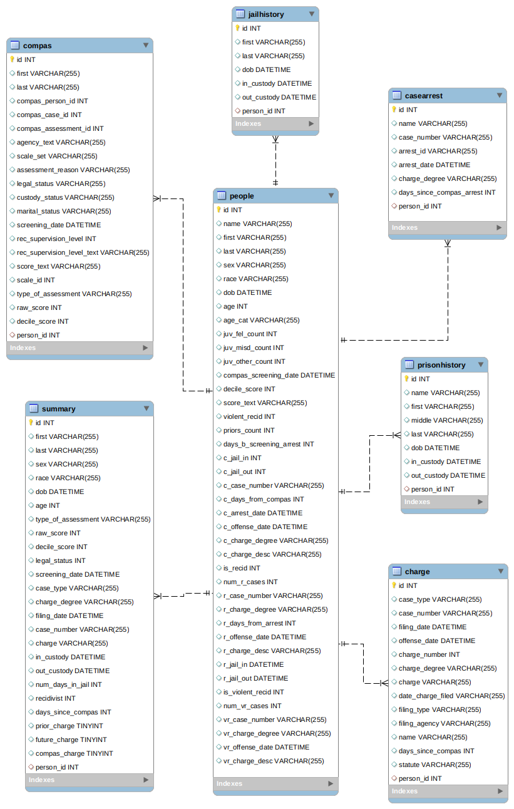

**Ignacia Aguilera, Camilo Ramírez, Sebastián Zapata** - ***Grupo 16***<br>
Curso CC5206 Introducción a la Minería de Datos<br>
Profesores: Felipe Bravo, Bárbara Poblete<br>
Facultad de Ciencias Físicas y Matemáticas, Universidad de Chile

# Introducción y motivación

Este informe se enmarca en el curso de Introducción a la Minería de Datos (CC5206) de la Universidad de Chile, para documentar el hito inicial (1) del proyecto minería de datos sobre el dataset asociado a COMPAS de [Northpointe](https://www.northpointe.com/) generado por [ProPublica](https://www.propublica.org/).

COMPAS es el acrónimo de *Correctional Offender Management Profiling for Alternative Sanctions*, que es traducible como "Gestión de perfiles de reos penitenciarios para penas alternativas" y corresponde a un algoritmo que busca predecir la probabilidad de reincidencia de un criminal al asignarle un puntaje (*score*) que representa la misma ([se puede encontrar su documentación aquí](https://assets.documentcloud.org/documents/2840784/Practitioner-s-Guide-to-COMPAS-Core.pdf)). Este método pertenece a la familia de algoritmos de evaluación de riesgo penitenciario (*risk assesment*) y se ha utilizado en diversas cortes de Estados Unidos como insumo para los jueces en la determinación del otorgamiento de libertad condicional a los imputados por algún delito.Esto responde a la necesidad de ese país de doscongestionar sus prisiones de forma eficiente. Es importante distinguir que este algoritmo no fue diseñado ni se ha utilizado para determinar la culpabilidad de alguna persona en un delito, ni para determinar una pena.

Un [estudio](https://www.propublica.org/article/machine-bias-risk-assessments-in-criminal-sentencing) realizado por ProPublica encontró un significativo sesgo racial en los resultados de puntaje COMPAS a desfavor de las personas afroamericanas a pesar que este atributo de las personas no se ingresaba como entrada al algoritmo. ProPublica además de publicar los resultados del estudio, publicó su [metdología](https://github.com/caitlinkuhlman/bpdmtutorial/blob/master/tutorial-COMPAS.ipynb) y un dataset generado a partir de la reccopilación de datos realizada por la agencia periodística. Las publicaciones se encuentran presente en el [repositorio de GitHub](https://github.com/propublica/compas-analysis) de ProPublica

# Problemática central

La problematica a abordar en este proyecto se basa en el análisis de datos del dataset "compas", principalmente al estudio efectuado por ProPublica que revela una serie de sesgos que son identificables en la metodologia de estimación para predecir la probabilidad de reincidencia de un criminal debido a estos datos es necesario un análisis para poder identificar datos relevantes.

El objetivo de este proyecto es analizar y detectar los posibles sesgos que tenga COMPAS en un espectro más amplio de atributos además de verificar el sesgo racial descrito por el informe de ProPublica. Adicional a esto se busca determinar una forma de disminuir los sesgos detectados o determinar la imposibilidad de realizar lo anterior mediante la exploración de los datos correspondientes en el hito 1.

Para esto se pretende abordar en tornos a los datos, las correlaciones entres los distintos atributos como indice de reinicidencia, raza, sexo, rango de edad, etc. Esto permitira encontrar sesgos que podran ser los mismo presentados por ProPublica y/o otros. Para cumplir este objetivo se trabaja con el dataset principal publicado en el repositorio contenido en el fichero ```compas.db``` que corresponde a una base de datos de sqlite3. Esta se importa en R y utilizando esta herramienta, se hace un análisis de datos, eventualmente una limpieza y reducción de atributos para comenzar a analizar correlaciones que se puedan encontrar, los atributos que se consideran de interés corresponden a la etnia (raza) y género de las personas. En base a correlaciones de interés encontradas, se aplicarán herramientas de minería de datos más sofisticadas en los próximos hitos del proyecto.

Otras formas de encontrar relaciones y explorar los datos para el hito 1, sera relacionar las salidas del sistema con las variables de entrada, tambien podemos definir relaiones de interdependencia entre las variables que componen el dataset.

# Descripción de los datos 

En primer lugar, para trabajar de manera cómoda con la base de datos, es necesario contar con un diagrama Entidad-Relación de esta. Así es posible realizar una inspección visual de las tablas de manera compacta y hacerse una idea del entorno sobre el cuál se trabaja. Para crear este diagrama, se hizo uso de un software llamado [DB Browser for SQLite](https://sqlitebrowser.org/) que permite convertir ficheros de extensión *.db* a ficheros con instrucciones SQL para recrear esta base de datos en cualquier sistema que permita dicho lenguaje. Dentro de este programa, se abrió el archivo ```compas.db``` para luego exportarlo en formato SQL.

Obtenido un archivo ```compas.sql```, se hace uso de un segundo software: [MySQL Workbench](https://www.mysql.com/products/workbench/). Este permite leer archivos de extensión *.sql* para generar una nueva base de datos. Para continuar el proceso, dentro del programa se debe crear un nuevo modelo para posteriormente importar el nuevo archivo generado anteriormente. Al hacerlo, se genera automáticamente un diagrama de Entidad-Relación, este se muestra a continuación:



Es necesario mencionar que las instrucciones SQL del archivo generado con la herramienta *DB Browser* no cuentan con un máximo de caracteres para las columnas de tipo *VARCHAR* por lo que se debe editar manualmente para añadir un máximo de caracteres como sigue: *VARCHAR(255)*. A partir de este diagrama, es posible identificar que la tabla **people** (relativa a las personas) es la columna vertebral de esta base de datos. Alrededor de esta tabla, se pueden encontrar seis más ("compas", "jailhistory", "casearrest, "summary", "prisonhistory" y "charge") con distintos atributos que pertenecen a una persona en específico (notar la llave foránea al id de una persona), estos datos serán analizados posteriormente.

# Exploración de datos

A modo de hacer el informe replicable, se deja explícito el código fuente utilizado. Para trabajar con ```compas.db``` se comienza importando las librerías requeridas, importando el fichero de la base de datos a través de una clase de SQL manejable por R para posteriormente extraer los dataframes del mismo.
```{r, results = "hold", results="hide"}
library(RSQLite)

filename <- "compas.db"
sqlite.driver <- dbDriver("SQLite")
db <- dbConnect(sqlite.driver, dbname = filename)

people        <- dbReadTable(db,"people")
casearrest    <- dbReadTable(db,"casearrest")
charge        <- dbReadTable(db,"charge")
compas        <- dbReadTable(db,"compas")
jailhistory   <- dbReadTable(db,"jailhistory")
prisonhistory <- dbReadTable(db,"prisonhistory")
summary       <- dbReadTable(db,"summary")
```

Es posible además mostrar el tamaño de cada Dataframe:
```{r, collapse=TRUE}
dim1 <- paste(" casearrest rows:", dim(casearrest)[1],"; cols:", dim(casearrest)[2],"\n")
dim2 <- paste("charge rows:", dim(charge)[1],"; cols:", dim(charge)[2],"\n")
dim3 <- paste("compas rows:", dim(compas)[1],"; cols:", dim(compas)[2],"\n")
dim4 <- paste("jailhistory rows:", dim(jailhistory)[1],"; cols:", dim(jailhistory)[2],"\n")
dim5 <- paste("prisonhistory rows:", dim(prisonhistory)[1],"; cols:", dim(prisonhistory)[2],"\n")
dim6 <- paste("summary rows:", dim(summary)[1],"; cols:", dim(summary)[2],"\n")
dim7 <- paste("people rows:", dim(people)[1],"; cols:", dim(people)[2],"\n")
cat(paste(dim1,dim2,dim3,dim4,dim5,dim6,dim7))
```
Dado que la relación *summary* no tiene ninguna tupla, se descarta trbajar con ella, por otro lado, se sabe que la relación central del database corresponde a *people*, por lo que conviene enlistar y obtener un extracto de sus atributos.
```{r}
str(people)
```
En base a lo observado se pueden analizar los atributos y eventualmente reducir la dimensionalidad de los datos.

- ```id``` es la llave primaria de la relación, permite identificar a una única persona
- ```name```, ```first``` y ```last``` tienen relación con el nombre de las personas, dado que estas ya son identificables por ```id```, estas relaciones son prescindibles.
- ```sex``` y ```race``` corresponden al sexo y raza de las personas y son atributos demográficos categóricos de interés y donde se centró el análisis realizado por ProPublica.
- ```dob``` *(date of birth)*, ```age``` y ```age_cat``` son atributos que tienen relacion con la edad de las personas, en particular ```dob``` aporta su fecha de nacimiento, con lo que se pueden inferir los otros dos, aún así, para el análisis que se desea realizar basta conservar el atributo ```age```.
- ```juv_fel_count``` *(juvenile fellonies count)*, ```juv_misd_count``` *(juvenile misdemeanor count)*, ```juv_other_count``` corresponden a atributos que cuentan la cantidad de delitos graves *(fellonies)*, menores *(misdemeanor)* u otros que cometió una persona durante su juventud.
- ```compas_screening_date``` corresponde a la fecha en la que se calculó el puntaje de esta persona con COMPAS, a efectos del análisis de sesgos, se considera irrelevante.
- ```decile_score``` corresponde a la asignación numérica del puntaje, mientras en el dataset ```score_text``` solo arroja valores NA (verificable con ```people[!is.na(people$score_text), ]```).
El resto de los atributos corresponden a detalles respecto a su reclusión tanto en su caso original como en aquel que reincidieron posterior a su liberación condicional, respecto a esto hay un atributo de importancia, que corresponde a:
- ```is_recid```, indica si existe reincidencia en la persona analizada por COMPAS, adquiere valor ```-1``` en caso de no haber.

Para comprender la demografía involucrada, a continuación se enlistan los atributos de sexo y raza y se asignan como factores categoricos junto al puntaje.
```{r}
people$sex <- as.factor(people$sex)
people$race <- as.factor(people$race)
people$decile_score <- as.factor(people$decile_score)

summary(people$sex)
summary(people$race)
summary(people$decile_score)
```
Considerando estas categorías, se hace un breve análisis etáreo de los puntajes:
```{r}
plot(people$decile_score, people$age,
     xlab="Puntaje asignado por COMPAS",ylab="Edad (años)")
```
Lo que muestra una leve correlación donde a medida que aumenta el puntaje COMPAS disminuye la edad, esto se puede corroborar con la función de correlación:
```{r}
cor(people$age, as.numeric(people$decile_score))
```

<!-- A continuación se exhiben algunos valores que muestran la correlación de diversos datos que pueden resultar de interés. Un valor de correlación se expresa como la forma de medir la dependencia entre dos variables (X,Y) y como es que una de ellas se comportaría al hacer variar la otra. De esta forma, mientras este valor esté muy cercano a 1, se dice que los datos están fuertemente correlacionados, su proporción es casi directa. Por otro lado, si se acerca mucho a -1 , quiere decir que los datos son demasiado correlacionados inversamente. Para valores cercanos a 0, se dice que la relación entre los datos es casi nula. Y no existe relación alguna si este valor es igual a 0. -->

```{r}
compas_violence = merge(compas[compas$scale_id == 7, ], people, by.x = "person_id", by.y = "id")
compas_recidivism = merge(compas[compas$scale_id == 8, ], people, by.x = "person_id", by.y = "id")
compas_failure_appear = merge(compas[compas$scale_id == 18, ], people, by.x = "person_id", by.y = "id")
```

Se separaron los puntajes de compas entre los tres distintos podibles: *Risk of Violence*, *Risk of Recidivism* y *Risk of Failure to Appear*. Luego se hizo uso de la función *cor* de R donde se analizó la correlación entre distintas variables, tales como: edad, sexo, raza o si ha sido reincidente con o sin violencia.